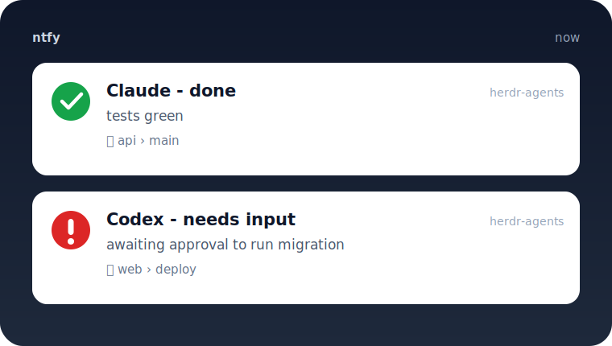

# herdr-ntfysh

> Get an [ntfy](https://ntfy.sh) push the moment a [herdr](https://herdr.dev) agent finishes or needs your input.

[](https://github.com/cobanov/herdr-ntfysh/releases)
[](./LICENSE)


<p align="center">
  
</p>

Start a long task, walk away, and your phone (or desktop) pings when the agent is **done** or **blocked** — across every workspace. One small Go binary, **zero runtime dependencies**.

## Quick start

```bash
# 1 · Install — herdr compiles it during install (needs Go ≥ 1.23, once)
herdr plugin install cobanov/herdr-ntfysh

# 2 · Configure your ntfy server + topic
cp .env.example "$(herdr plugin config-dir cobanov.herdr-ntfysh)/.env"
$EDITOR "$(herdr plugin config-dir cobanov.herdr-ntfysh)/.env"

# 3 · Send a test push to confirm it works
herdr plugin action invoke cobanov.herdr-ntfysh.test
```

Minimum config is two lines:

```ini
HERDR_NTFY_SERVER=https://ntfy.example.com
HERDR_NTFY_TOPIC=herd
```

Done. From now on, `done` and `blocked` notifications fire automatically for agents in **every** workspace — no restart, no per-workspace setup.

## Features

- 🔔 **Pings when it matters** — notifies on `done` and `blocked` by default; `working`/`idle` are opt-in.
- 🌍 **All workspaces** — one global hook covers every pane.
- 🎯 **Reliable "done"** — catches both herdr's explicit `done` and a `working → idle` turn end.
- 🤫 **No spam** — per-pane, windowed debounce.
- 🔐 **Self-hosted friendly** — Bearer token, Basic auth, custom CA or insecure TLS.
- 📦 **Zero deps** — a single static Go binary, no `node`/`curl`.
- 🛟 **Fail-safe** — a bad config or an unreachable server never disrupts herdr.

## Configuration

Settings live in `.env` inside the plugin's config dir (or as env vars, which override the file). Most-used keys:

| Key | Default | What it does |
|---|---|---|
| `HERDR_NTFY_SERVER` | — | ntfy base URL incl. scheme *(required)* |
| `HERDR_NTFY_TOPIC` | — | ntfy topic *(required)* |
| `HERDR_NTFY_TOKEN` | — | ntfy access token (Bearer auth) |
| `HERDR_NTFY_USERNAME` / `_PASSWORD` | — | HTTP Basic auth |
| `HERDR_NTFY_NOTIFY_ON` | `done,blocked` | which kinds notify (`done,blocked,working,idle`) |
| `HERDR_NTFY_DEDUP_WINDOW` | `10` | seconds to suppress a repeat of the same kind |
| `HERDR_NTFY_TLS_INSECURE` / `_CA_FILE` | — | self-signed / custom-CA TLS |
| `HERDR_NTFY_DEBUG` | `false` | log raw event + decision for troubleshooting |

See [`.env.example`](./.env.example) for the complete list (priority, title prefix, tags, click URL, …).

<details>
<summary><b>Self-hosted ntfy</b> — auth &amp; TLS</summary>

Pick at most one auth method (a token wins over basic credentials):

```ini
HERDR_NTFY_TOKEN=tk_xxxxxxxxxxxx      # access token (Bearer)
# — or —
HERDR_NTFY_USERNAME=herder
HERDR_NTFY_PASSWORD=changeme
```

For a private certificate, prefer pinning your CA over disabling verification:

```ini
HERDR_NTFY_CA_FILE=/etc/ssl/certs/my-ntfy-ca.pem   # recommended
HERDR_NTFY_TLS_INSECURE=true                        # last resort
```
</details>

## Actions

```bash
herdr plugin action invoke cobanov.herdr-ntfysh.doctor   # print resolved config (secrets redacted)
herdr plugin action invoke cobanov.herdr-ntfysh.test     # send a test push through the whole pipeline
```

Bind the test action to a key in `~/.config/herdr/config.toml` if you like:

```toml
[[keys.command]]
key = "prefix+n"
type = "shell"
command = "herdr plugin action invoke cobanov.herdr-ntfysh.test"
```

## How it works

herdr rolls each pane up to `idle · working · blocked · done` and fires
`pane.agent_status_changed`. This plugin maps those transitions to a push:
entering **blocked** alerts you, and a completed turn — herdr's explicit `done`
**or** a `working → idle` transition — alerts you as **done**. It debounces
repeats per pane and reads config fresh on every event, so changes need no
restart. See [ARCHITECTURE.md](./ARCHITECTURE.md) for the design.

## Troubleshooting

- **No notifications?** Run `…doctor` to check server/topic/auth, then `…test`. Set `HERDR_NTFY_DEBUG=1` and read `herdr plugin log list --plugin cobanov.herdr-ntfysh`.
- **TLS errors** on a self-hosted server → set `HERDR_NTFY_CA_FILE` (preferred) or `HERDR_NTFY_TLS_INSECURE=true`.
- **Too noisy?** Raise `HERDR_NTFY_DEDUP_WINDOW`, or set `HERDR_NTFY_NOTIFY_ON=blocked`.

<details>
<summary><b>Why another ntfy plugin?</b></summary>

A ground-up rewrite of the idea behind [zom-2018/herdr-ntfy-notify](https://github.com/zom-2018/herdr-ntfy-notify), built to the quality bar of the first-class herdr plugins:

| | herdr-ntfysh | zom-2018/herdr-ntfy-notify |
|---|---|---|
| Language | Go, single static binary | Node `.mjs` |
| Runtime deps | **none** (Go stdlib only) | `node` + shells out to `curl` |
| Debounce / dedup | ✅ per-pane, windowed, persisted | ❌ can re-fire |
| Completion detection | explicit `done` **and** `working → idle` | raw status only |
| Self-signed TLS | ✅ custom CA **or** insecure toggle | partial |
| Header safety | ASCII-clean, emoji via ntfy tags | raw emoji in headers |
| `--doctor` / `--debug` | ✅ | ❌ |
| Failure policy | never disrupts herdr | unclear |
| Tests | unit + e2e smoke | unit only |
</details>

## License

MIT — see [LICENSE](./LICENSE).
